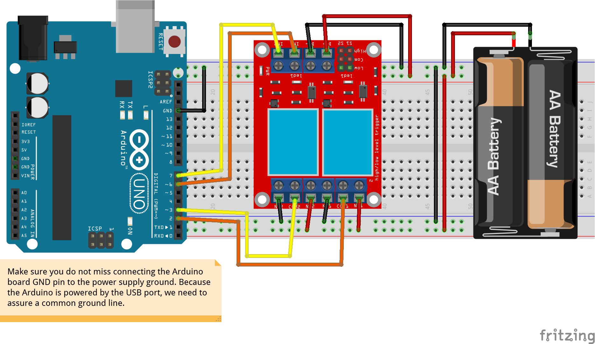

# PyFirmata Playground

To start working:

* run `python -m pipenv install --dev` to get develop dependencies in a virtual Python environment
* select the virtual environment by
  * `CTRL + Shift + P` and
  * type `>Python: Select Interpreter` and
  * then select the `.venv: pipenv` Python version

Have fun!

This is my hardware setup for running the `test_nano_hil`:

